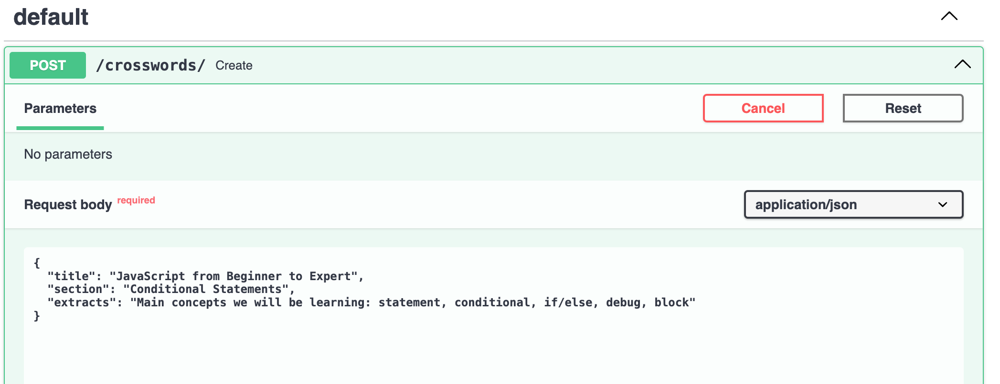
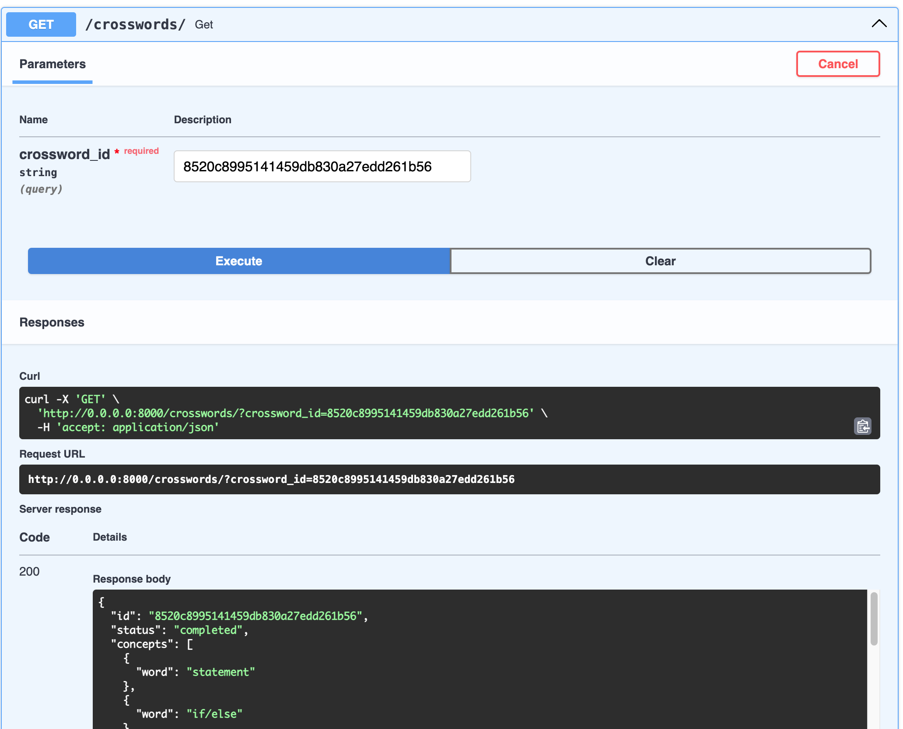

# AI Powered Crosswords

## Introduction
This project is a simple implementation of a crossword puzzle solver using AI.

## Main Components

### Fine-tuning LLama13b
After running and testing llama13B locally, I tested getting crosswords clues from given words. Even after giving a few 
single shot examples in prompts, examples were mitigated. Clues were either definitions of the word itself or would 
contain the word or had very wrong formatting.  

Hence, I decided to fine tune the model on a dataset of crosswords clues and answers. I used the dataset from the New
York Times crosswords in [kaggle](https://www.kaggle.com/datasets/darinhawley/new-york-times-crossword-clues-answers-19932021).

After fine-tuning it on my AWS account, I downloaded the main necessary files for the model and ran the inference on my local M2 mac.

Comparing before and after with the fine tune models:


Once I got a better model to generate clues from given words, I created a few components that help extracting concepts 
from any content, generating a small crossword puzzle. 

### Crosswords generation
A few modules in the crosswords domain:
- `concepts` to extract concepts/words from any text content
- `clues` to model clues from words, generate clues from concept in a context, and generate explanations (to filter out weird clues generated still)
- `board` to generate a crossword board from a list of words, using a big grid, iterating over the words, trying to intersect and place them, then trimming them. I select the best crosswords from the number of words eventually placed and the best density. 

### API server and frontend
- FastAPI <TODO>
- Webpack <TODO>

## How to run

### For fine-tuning LLama13b
- Create an AWS role `Sagemaker_deploy_training_role`
- Make sure you have quota to run `ml.g5.24xlarge` instances, needed for fine-tuning llama 13b
- Go to the `fine_tuning` directory
- Run `python main.py`, monitor the progress. It should take about 1h to fine-tune the model

To run the inference model:
- clone `https://github.com/ggerganov/llama.cpp` and go to `llama.cpp` directory
- download the fine-tuned model files in S3: they should be in a S3 bucket that looks like that:
  - `sagemaker-us-west-2-<id> / meta-textgeneration-llama-2-13b-<date-format>/output/model`

  - place them in the `models/13B-invent-clue` directory
  - the main files needed: `*.safetensors`, `tokenizer.model`, `tokenizer_config.json`, `special_tokens_map.json`, `config.json`, `generation_config.json`
- Follow the steps to convert this model in llama.cpp:
  - `python3 convert.py models/13B-invent-clue`
  - `./quantize ./models/13B-invent-clue/ggml-model-f16.gguf ./models/13B-invent-clue/ggml-model-Q4_K_M.gguf Q4_K_M`
  - `./quantize ./models/13B-invent-clue/ggml-model-Q4_K_M.gguf ./models/13B-invent-clue/ggml-model-Q4_K_M-v2.gguf COPY`

Then you can run the inference that way:
```shell
./server -m models/13B-invent-clue/ggml-model-Q4_K_M.gguf -c 2048
```

### Running server

To run the environment:
```shell
# If using pyenv: 
pyenv install 3.11.5
pyenv global 3.11.5

# Create virtualenv
python -m venv ~/.virtualenvs/crosswords_ai
source ~/.virtualenvs/crosswords_ai/bin/activate
pip install -r requirements.txt
```

To run python tests: `python -m unittest crosswords/**/*.py`

To run the server:
```shell
uvicorn crosswords.main:app --reload
```

Then go to: http://0.0.0.0:8000/docs#/default and test `POST` and `GET` endpoints.




Running file `test_clues` for an individual crossword should return something like this:
```python 
Concepts ['else', 'instruction', 'conditional', 'debug', 'function']

<Word: else, Clue: "If not, then ..." (Explanation: else is a synonym of otherwise)>
<Word: else, Clue: "In case" (Explanation: else is a synonym of in case)>
<Word: instruction, Clue: "Tell me what to do!" (Explanation: An instruction is an instruction to guess for a clue)>
<Word: instruction, Clue: What a recipe is (Explanation: Instruction is a clue for it)>
<Word: conditional, Clue: Like a "if" statement in programming (Explanation: The word to guess is "if")>
<Word: conditional, Clue: ___ statement (Explanation: Conditional is a type of statement)>
<Word: debug, Clue: Test out, as a program (Explanation: Debug is a synonym of test out)>
<Word: debug, Clue: Find and fix a bug (Explanation: Debug is a verb which means to find and fix a bug)>
<Word: debug, Clue: Test a program (Explanation: Debug is to test a program, as in "debug a new app")>
<Word: function, Clue: Word with code (Explanation: function is a clue for it)>

Best Crossword Words: {'else': ((2, 4), (0, 1)), 'instruction': ((0, 6), (1, 0)), 'conditional': ((0, 0), (0, 1)), 'debug': ((1, 4), (1, 0)), 'function': ((7, 2), (0, 1))}.
Density: 0.2892561983471074
c o n d i t i o n a l 
. . . . d . n . . . . 
. . . . e l s e . . . 
. . . . b . t . . . . 
. . . . u . r . . . . 
. . . . g . u . . . . 
. . . . . . c . . . . 
. . f u n c t i o n . 
. . . . . . i . . . . 
. . . . . . o . . . . 
. . . . . . n . . . . 
```

