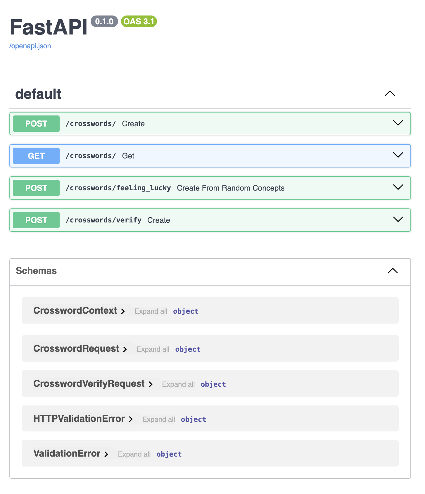
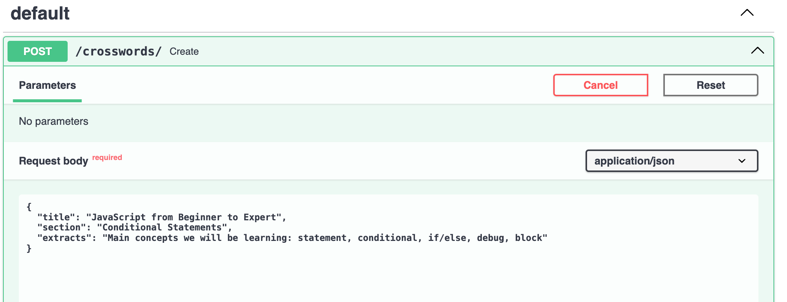
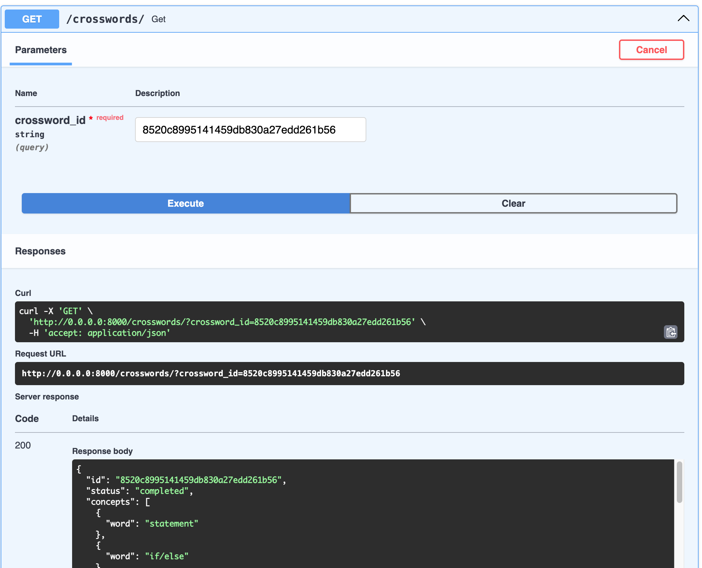

# FastAPI Server

## Setup
Note: You can also run all the backend API server and frontend with mocked data if you set up the following 
environment variable in the `.env` file:
```shell
MOCK_DATA=1
```
This can help if you dont have the LLM set up locally and want to test the rest.

```shell
# If using pyenv: 
pyenv install 3.11.5
pyenv global 3.11.5

# Create virtualenv
python -m venv ~/.virtualenvs/crosswords_ai
source ~/.virtualenvs/crosswords_ai/bin/activate
pip install -r requirements.txt
```

## Running the components

Run docker-compose to run Redis:
```shell
docker-compose up -d
```

To run the fast API server:
```shell
uvicorn crosswords.main:app --reload
```

## Testing
To test all is running, go to: http://0.0.0.0:8000/docs#/default and test `POST` and `GET` endpoints.





Running file `test_clues` for an individual crossword should return something like this:
```python 
"""
Words ['analog', 'revoke', 'mario', 'dudes', 'binge', 'tilt', 'lan']
Done generating the board.... Took:  1  seconds
Done generating the clues.... Took:  9  seconds

<Word: analog, Clue: "___ TV" (Explanation: )>
<Word: revoke, Clue: Cancel, as a permit (Explanation: )>
<Word: mario, Clue: Nintendo mascot (Explanation: )>
<Word: dudes, Clue: Guys (Explanation: )>
<Word: binge, Clue: Watch a whole season of in one sitting (Explanation: )>
<Word: tilt, Clue: Push (Explanation: )>
<Word: lan, Clue: - ___ Tran (Explanation: )>

Best Crossword Words: {'analog': ((3, 3), (0, 1)), 'binge': ((0, 8), (1, 0)), 'mario': ((2, 3), (1, 0)), 'revoke': ((6, 0), (0, 1)), 'dudes': ((3, 1), (1, 0)), 'tilt': ((1, 7), (0, 1)), 'lan': ((3, 6), (1, 0))}.
. . . . . . . . b . .
. . . . . . . t i l t
. . . m . . . . n . .
. d . a n a l o g . .
. u . r . . a . e . .
. d . i . . n . . . .
r e v o k e . . . . .
. s . . . . . . . . .
"""
```
Other examples with smaller and bigger set of words:
```python
"""
Words ['dreaded', 'sweep', 'pawn', 'ion']
<Word: dreaded, Clue: Frightening (Explanation: )>
<Word: sweep, Clue: Floor-cleaning tool (Explanation: )>
<Word: pawn, Clue: Chess piece that can move straight forward two squares (Explanation: )>
<Word: ion, Clue: Chemistry symbol (Explanation: )>

. . d . . 
. . r . i 
. . e . o 
. p a w n 
. . d . . 
s w e e p 
. . d . . 
"""

"""
Words ['normandy', 'inactive', 'soprano', 'grating', 'meteor', 'nested', 'nested', 'ninjas', 'itunes', 'saint', 'diana', 'naps', 'lear', 'alta', 'roth']
<Word: normandy, Clue: Where the Allies landed on D-Day (Explanation: )>
<Word: inactive, Clue: ___ agent (Explanation: )>
<Word: soprano, Clue: Highest female voice (Explanation: )>
<Word: grating, Clue: Like some noise (Explanation: )>
<Word: meteor, Clue: Rocket to stardom? (Explanation: )>
<Word: nested, Clue: Like dolls in a dollhouse (Explanation: )>
<Word: nested, Clue: Like dolls inside a dollhouse (Explanation: )>
<Word: ninjas, Clue: Spying superheroes of Marvel Comics (Explanation: )>
<Word: itunes, Clue: "___ in the Cloud," 2011 Steve Jobs keynote (Explanation: )>
<Word: saint, Clue: ___ Louis de Montfort (Explanation: )>
<Word: diana, Clue: Catherine of ___ (Explanation: )>
<Word: naps, Clue: Brief slumbers (Explanation: )>
<Word: lear, Clue: "The Fool doth think he is wise, but the Wiseman knows himself to be a (Explanation: )>
<Word: alta, Clue: ___ Merez, French singer-songwriter (Explanation: )>
<Word: roth, Clue: Beneficiary of an IRA, say (Explanation: )>

. . . . . g . . . . . . . 
. a . . . r o t h . . . . 
. l . . . a . . . . . . . 
. t . . . t . i t u n e s 
n a p s . i . . . . i . . 
. . . o . n o r m a n d y 
. s . p . g . . e . j . . 
. a . r . . d . t . a . . 
. i n a c t i v e . s . . 
. n . n . . a . o . . . . 
. t . o . . n . r . . . . 
. . . . l e a r . . . . . 
"""
```


## Developing

- To run python tests: `python -m unittest crosswords/**/*.py`
- Running coverage:
    - `coverage run -m unittest crosswords/**/*.py`
    - `coverage report -m`
- Formatting: `python -m black crosswords`

## Bag of words
If you want to use random words, you can generate a bad og words from the NYT dataset:
```shell
cat nytcrosswords.csv| awk '{print $1}' |  awk -F','  '{print $2}' | sort | uniq > unique_words.txt
```
and save it in `/fine_tuning/dataset/unique_words.txt` 